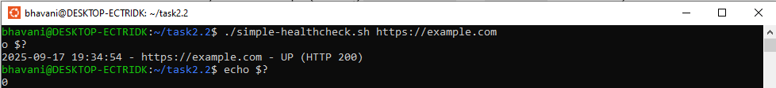
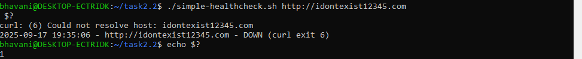
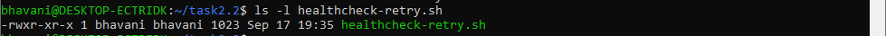
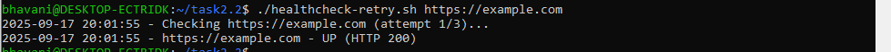

# Application Health Checker

A simple Bash script to check if an application is **UP** or **DOWN** by
verifying its HTTP status code.

## Features

-   Sends an HTTP request to the given URL
-   Considers status codes `2xx` and `3xx` as **UP**
-   Any other response is **DOWN**
-   Returns exit code `0` (UP) or `1` (DOWN)

## Usage

``` bash
chmod +x healthcheck.sh
./healthcheck.sh https://example.com
```

## Screenshots

### 1. Script Executable
Shows the script file with executable permissions:


### 2. Application UP
Running the script against a live URL (`https://example.com`) returns UP:


### 3. Application DOWN
Running the script against an endpoint that returns an error (`https://httpstat.us/500`) shows DOWN:


### 4. Exit Codes
Demonstrating that the script exits with code `0` (UP) and `1` (DOWN):

